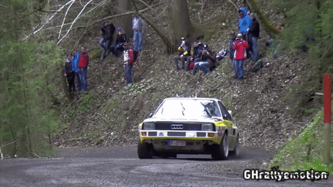

# Super-SloMo [](https://opensource.org/licenses/mit-license.php)
PyTorch implementation of "Super SloMo: High Quality Estimation of Multiple Intermediate Frames for Video Interpolation" by Jiang H., Sun D., Jampani V., Yang M., Learned-Miller E. and Kautz J. [[Project]](https://people.cs.umass.edu/~hzjiang/projects/superslomo/) [[Paper]](https://arxiv.org/abs/1712.00080)

__Check out [our paper](https://github.com/avinashpaliwal/Deep-SloMo) "Deep Slow Motion Video Reconstruction with Hybrid Imaging System" published in TPAMI.__

## Results
Results on UCF101 dataset using the [evaluation script](https://people.cs.umass.edu/~hzjiang/projects/superslomo/UCF101_results.zip) provided by paper's author. The `get_results_bug_fixed.sh` script was used. It uses motions masks when calculating PSNR, SSIM and IE.

| Method | PSNR | SSIM | IE |
|------|:-----:|:-----:|:-----:|
| DVF | 29.37 | 0.861 | 16.37 |
| [SepConv](https://github.com/sniklaus/pytorch-sepconv) - L_1 | 30.18 | 0.875 | 15.54 |
| [SepConv](https://github.com/sniklaus/pytorch-sepconv) - L_F | 30.03 | 0.869 | 15.78 |
| SuperSloMo_Adobe240fps | 29.80 | 0.870 | 15.68 |
| **pretrained mine** | **29.77** | **0.874** | **15.58** |
| SuperSloMo | 30.22 | 0.880 | 15.18 |





## Prerequisites
This codebase was developed and tested with pytorch 0.4.1 and CUDA 9.2 and Python 3.6.
Install:
* [PyTorch](https://pytorch.org/get-started/previous-versions/)

For GPU, run
```bash
conda install pytorch=0.4.1 cuda92 torchvision==0.2.0 -c pytorch
```
For CPU, run
```bash
conda install pytorch-cpu=0.4.1 torchvision-cpu==0.2.0 cpuonly -c pytorch
```
* [TensorboardX](https://github.com/lanpa/tensorboardX) for training visualization
* [tensorflow](https://www.tensorflow.org/install/) for tensorboard
* [matplotlib](https://matplotlib.org/users/installing.html) for training graph in notebook.
* [tqdm](https://pypi.org/project/tqdm/) for progress bar in [video_to_slomo.py](video_to_slomo.py)
* [numpy](https://scipy.org/install.html)

## Training
### Preparing training data
In order to train the model using the provided code, the data needs to be formatted in a certain manner.
The create_dataset.py script uses [ffmpeg](https://www.ffmpeg.org/) to extract frames from videos.
#### Adobe240fps
For adobe240fps, [download the dataset](http://www.cs.ubc.ca/labs/imager/tr/2017/DeepVideoDeblurring/DeepVideoDeblurring_Dataset_Original_High_FPS_Videos.zip), unzip it and then run the following command
```bash
python data\create_dataset.py --ffmpeg_dir path\to\folder\containing\ffmpeg --videos_folder path\to\adobe240fps\videoFolder --dataset_folder path\to\dataset --dataset adobe240fps
```

#### Custom
For custom dataset, run the following command
```bash
python data\create_dataset.py --ffmpeg_dir path\to\folder\containing\ffmpeg --videos_folder path\to\adobe240fps\videoFolder --dataset_folder path\to\dataset
```

The default train-test split is 90-10. You can change that using command line argument `--train_test_split`.

Run the following commmand for help / more info
```bash
python data\create_dataset.py --h
```

### Training
In the [train.ipynb](train.ipynb), set the parameters (dataset path, checkpoint directory, etc.) and run all the cells.

or to train from terminal, run:
```bash
python train.py --dataset_root path\to\dataset --checkpoint_dir path\to\save\checkpoints
```
Run the following commmand for help / more options like continue from checkpoint, progress frequency etc.
```bash
python train.py --h
```

### Tensorboard
To get visualization of the training, you can run tensorboard from the project directory using the command:
```bash
tensorboard --logdir log --port 6007
```

and then go to [https://localhost:6007](https://localhost:6007).

## Evaluation
### Pretrained model
You can download the pretrained model trained on adobe240fps dataset [here](https://drive.google.com/open?id=1IvobLDbRiBgZr3ryCRrWL8xDbMZ-KnpF).

### Video Converter
You can convert any video to a slomo or high fps video (or both) using [video_to_slomo.py](video_to_slomo.py). Use the command
```bash
# Windows
python video_to_slomo.py --ffmpeg path\to\folder\containing\ffmpeg --video path\to\video.mp4 --sf N --checkpoint path\to\checkpoint.ckpt --fps M --output path\to\output.mkv

# Linux
python video_to_slomo.py --video path\to\video.mp4 --sf N --checkpoint path\to\checkpoint.ckpt --fps M --output path\to\output.mkv
```
If you want to convert a video from 30fps to 90fps set `fps` to 90 and `sf` to 3 (to get 3x frames than the original video).

Run the following commmand for help / more info
```bash
python video_to_slomo.py --h
```

You can also use `eval.py` if you do not want to use ffmpeg. You will instead need to install `opencv-python` using pip for video IO.
A sample usage would be:

```bash
python eval.py data/input.mp4 --checkpoint=data/SuperSloMo.ckpt --output=data/output.mp4 --scale=4
```

Use `python eval.py --help` for more details

More info TBA


## References:
Parts of the code is based on [TheFairBear/Super-SlowMo](https://github.com/TheFairBear/Super-SlowMo)

